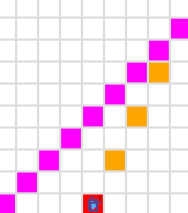

<hr />
<details>
<summary>Q4: Cleanup Karel, Milestone 2 - Spoiler: Tests failed like 🦾😀😂</summary>
<details open>
<summary>Description</summary>
Karel has a bit of spring cleaning to do! Karel's world will have beepers in some positions in the bottom row; write a program to have Karel walk across the bottom row and, at each position, pick up a beeper only if one is present. Notice that you've already written the code to check if a beeper is present and only pick up a beeper if one is there from the previous milestone -- you should use your code from the previous milestone as a helper function to help with the decomposition of this problem!

Additionally, note that Karel's starting position will never contain a beeper, so there's no need to check it.

For example, if this is the initial starting world, with some beepers in the first row:

<br />

<br />

This should be the end result, with a clear bottom row:

<br />

<br />

We've provided you two worlds on which to test your code. You can toggle between them by changing the very last line in the file from run_karel_program('Cleanup1.w') to run_karel_program('Cleanup2.w') (and vice versa) -- you will likely need to press Run (it's fine if you do so without any code written) for the world change to take effect.
</details>
<details>
<summary>Code</summary>

`CleanupKarel.py`
```python
from karel.stanfordkarel import *

"""
File: CleanupKarel.py
--------------------
When you finish writing this file, CleanupKarel should be able to
pick up all beepers from the first row of any sized world and
end in the bottom right corner facing East.
"""

def main():
    """
    You should write your code to make Karel do its task in
    this function. Make sure to delete the 'pass' line before
    starting to write your own code. You should also delete this
    comment and replace it with a better, more descriptive one.
    """
    while no_beepers_present():
        move()
        if beepers_present():
            while beepers_present():
                pick_beeper()

if __name__ == '__main__':
    run_karel_program('Cleanup1.w')
```

`Cleanup1.w`
```yaml
Dimension: (5, 5)
Beeper: (2, 1); 1
Beeper: (4, 1); 1
Beeper: (5, 1); 1
Karel: (1, 1); east
BeeperBag: 0
```

This code executed with no
evident drawback, but at submit time, it exploded 🦾😍:

```text
Test failed!
	Student program crashed with this error:
	File "/home/CleanupKarel.py", line 19, in main
	    if front_is_clear():
	KarelInfiniteException: Executed more than 20000 commands - Karel might be stuck in an infinite loop!
```

After a "little" logic improvement, it passed the tests:

`CleanupKarel.py`
```python
while front_is_clear():
        move()
        if beepers_present():
            while beepers_present():
                pick_beeper()
```

`Cleanup2.w`
```yaml
Dimension: (7, 4)
Beeper: (2, 1); 1
Beeper: (5, 1); 1
Beeper: (3, 1); 1
Beeper: (7, 1); 1
Karel: (1, 1); east
BeeperBag: 0
```
</details>
</details>

<hr />
<details>
<summary>Q7: Midpoint (optional!) 💣</summary>
<details open>
<summary>Description</summary>
As an exercise in solving algorithmic problems, program Karel to place a single beeper at the middle of 1st Street (aka Row). For example, say Karel starts in the 5x5 world pictured in the figure:

<br />

<br />

Karel should end with Karel standing on a beeper in the following position:

<br />

<br />

Note that the final configuration of the world should have only a single beeper at the midpoint of 1st Street. Along the way, Karel is allowed to place additional beepers wherever it wants to, but must pick them all up again before it finishes. Similarly, if Karel paints/colors any of the corners in the world, they must all be uncolored before Karel finishes.

In solving this problem, you may count on the following facts about the world:

- Karel starts at the bottom left corner, facing east, with an infinite number of beepers in its bag.
- The initial state of the world includes no interior walls or beepers.
- The world need not be square, but you may assume that it is at least as tall as it is wide.

Your program, moreover, can assume the following simplifications:

- If the width of the world is odd, Karel must put the beeper in the center square. If the width is even, Karel may drop the beeper on either of the two center squares.
- It does not matter which direction Karel is facing at the end of the run.

There are many different algorithms you can use to solve this problem so feel free to be creative!

You should make sure your program runs successfully in all of the following worlds (which are just a few different examples to test out the generality of your solution): Midpoint.w (default world), `Midpoint1.w`, `Midpoint2.w`, `Midpoint8.w` .

You can toggle between worlds by changing `Midpoint.w` in the last line of the file (which is currently `run_karel_program`('Midpoint.w') to the filename of your choice (make sure to include the quotation marks around the filename) and running your program.
</details>
<details>
<summary>Code</summary>

<details>
<summary>Python File</summary>

Annnnd now... the most awaited case 🥁

`Midpoint.py`
```python
from karel.stanfordkarel import *

"""
File: Midpoint.py
------------------------
Place a beeper on the middle of the first row.
"""

def main():
    """
    Your code here
    """
    # 1 BLACK
    paint_corner(BLACK)
    if front_is_blocked():
        put_beeper()
        paint_corner(BLANK)

    # 2 BLUE
    move()
    paint_corner(BLUE)
    if front_is_blocked():
        put_beeper()
        paint_corner(BLANK)
        turn_around()
        while front_is_clear():
            move()
            paint_corner(BLANK)

    # 3 CYAN
    move()
    paint_corner(CYAN)
    if front_is_blocked():
        paint_corner(BLANK)
        turn_around()
        while front_is_clear():
            move()
            if corner_color_is(BLUE):
                put_beeper()
            paint_corner(BLANK)

    # 4 DARK_GRAY
    move()
    paint_corner(DARK_GRAY)
    if front_is_blocked():
        paint_corner(BLANK)
        turn_around()
        while front_is_clear():
            move()
            if corner_color_is(CYAN):
                put_beeper()
            paint_corner(BLANK)

    # 5 GRAY
    move()
    paint_corner(GRAY)
    if front_is_blocked():
        paint_corner(BLANK)
        turn_around()
        while front_is_clear():
            move()
            if corner_color_is(GRAY):
                put_beeper()
            paint_corner(BLANK)

    # 6 GREEN
    move()
    paint_corner(GREEN)
    if front_is_blocked():
        paint_corner(BLANK)
        turn_around()
        while front_is_clear():
            move()
            if corner_color_is(CYAN):
                put_beeper()
            paint_corner(BLANK)

    # 7 LIGHT_GRAY
    move()
    paint_corner(LIGHT_GRAY)
    if front_is_blocked():
        paint_corner(BLANK)
        turn_around()
        while front_is_clear():
            move()
            if corner_color_is(DARK_GRAY):
                put_beeper()
            paint_corner(BLANK)

    # 8 MAGENTA
    move()
    paint_corner(MAGENTA)
    if front_is_blocked():
        paint_corner(BLANK)
        turn_around()
        while front_is_clear():
            move()
            if corner_color_is(GRAY):
                put_beeper()
            paint_corner(BLANK)

    # 9 ORANGE
    move()
    paint_corner(ORANGE)
    if front_is_blocked():
        paint_corner(BLANK)
        turn_around()
        while front_is_clear():
            move()
            if corner_color_is(GRAY):
                put_beeper()
            paint_corner(BLANK)

    # 10 PINK
    move()
    paint_corner(PINK)
    if front_is_blocked():
        paint_corner(BLANK)
        turn_around()
        while front_is_clear():
            move()
            if corner_color_is(GREEN):
                put_beeper()
            paint_corner(BLANK)

    # 11 RED
    move()
    paint_corner(RED)
    if front_is_blocked():
        paint_corner(BLANK)
        turn_around()
        while front_is_clear():
            move()
            if corner_color_is(GREEN):
                put_beeper()
            paint_corner(BLANK)

    # 12 WHITE
    move()
    paint_corner(WHITE)
    if front_is_blocked():
        paint_corner(BLANK)
        turn_around()
        while front_is_clear():
            move()
            if corner_color_is(LIGHT_GRAY):
                put_beeper()
            paint_corner(BLANK)

    # 13 YELLOW
    move()
    paint_corner(YELLOW)
    if front_is_blocked():
        paint_corner(BLANK)
        turn_around()
        while front_is_clear():
            move()
            if corner_color_is(LIGHT_GRAY):
                put_beeper()
            paint_corner(BLANK)

def turn_around():
   turn_left()
   turn_left()

if __name__ == '__main__':
    run_karel_program('Midpoint3.w')
```

<b>YES!</b>. This failed.

```text
Test failed!
	Student program crashed with this error:
	File "/home/Midpoint.py", line 115, in main
	    move()
	KarelCrashException: Karel crashed while on avenue 1 and street 1, facing West
	Invalid action: Karel attempted to move, but its front was blocked.
```

NOTE: will come back to this later!

And what about this mind 💥 solution from `Sahaj Singh`.

He used geometry to do the following:


<details>
<summary>Sahaj Singh solution code</summary>

`ExtensionKarel.py`
```python
from karel.stanfordkarel import *

"""
File: Midpoint.py
------------------------
Place a beeper on the middle of the first row.
"""

def main():
    midpoint_of_square()

"""
Midpoint finder --
First use the diagonal to find the edge of the square (or assumed square)
Then of that edge, Make a downward slope of 1/2, which will find the midpoint of the base of square.
"""

def midpoint_of_square():
    face_east()
    # Finds the edge of the assumed square
    diagonal_of_square()
    # Finds the midpoint
    half_slope_stairs()

# Downward stairs: brings Karel down from the edge of the square.
# This is adjusted to work for both odd and even sqaures.

def half_slope_stairs():
    while no_beepers_present():
        face_south()
        if front_is_clear(): # This if else command is for the odd command to not break when it finds the south wall.
            move()
            if front_is_clear(): # This is the actual stairs function
                move()
                face_west() # Second "if-else command" is for the loop to not break in even world (after encountaring the south wall)
                move()
            else:
                put_beeper()# This "else command" supposed to work
                face_west() # in even square case
        else:
            put_beeper() # This else command supposed to work in odd case.
                         # and it also breaks this while loop
        half_slope_stairs() # This is a call back to the command

"""
Diagonal of square
This makes Karel run across diagonal, to find
a square if the world isn't exactly square.
"""

def diagonal_of_square():
    while front_is_clear():
        move()
        face_north()
        move()
        face_east()
        diagonal_of_square()

# Directions

def face_north():
    while not_facing_north():
        turn_left()

def face_west():
    while not_facing_west():
        turn_left()

def face_east():
    while not_facing_east():
        turn_left()

def face_south():
    while not_facing_south():
        turn_left()
```

</details>

</details>
<details>
<summary>Midpoint Files</summary>

`Midpoint1.w`
```yaml
Dimension: (1, 1)
BeeperBag: INFINITY
Karel: (1, 1); East
Speed: 0.75
```

`Midpoint2.w`
```yaml
Dimension: (2, 2)
Karel: (1, 1); east
BeeperBag: INFINITY
```

`Midpoint3.w`
```yaml
Dimension: (3, 2)
Karel: (1, 1); east
BeeperBag: INFINITY
```

`Midpoint4.w`
```yaml
Dimension: (4, 2)
Karel: (1, 1); east
BeeperBag: INFINITY
```

`Midpoint5.w`
```yaml
Dimension: (5, 10)
Karel: (1, 1); east
BeeperBag: INFINITY
```

`Midpoint6.w`
```yaml
Dimension: (6, 10)
Karel: (1, 1); east
BeeperBag: INFINITY
```

`Midpoint7.w`
```yaml
Dimension: (7, 10)
Karel: (1, 1); east
BeeperBag: INFINITY
```

`Midpoint8.w`
```yaml
Dimension: (8, 10)
Karel: (1, 1); east
BeeperBag: INFINITY
```

`Midpoint.w`
```yaml
Dimension: (9, 9)
Karel: (1, 1); east
BeeperBag: INFINITY
```

`Midpoint10.w`
```yaml
Dimension: (10, 10)
Karel: (1, 1); east
BeeperBag: INFINITY
```

`Midpoint11.w`
```yaml
Dimension: (11, 10)
Karel: (1, 1); east
BeeperBag: INFINITY
```

`Midpoint12.w`
```yaml
Dimension: (12, 10)
Karel: (1, 1); east
BeeperBag: INFINITY
```

`Midpoint13.w`
```yaml
Dimension: (13, 10)
Karel: (1, 1); east
BeeperBag: INFINITY
```

</details>

</details>
</details>

<hr />
<details>
<summary>Extension (optional!)</summary>
<details open>
<summary>Description</summary>
If you finish early, you may optionally write a Karel project of your own choice. Modify this file to use Karel to complete any task of your choosing! Extensions are a great chance for practice and to be creative. Make sure to write comments to explain what your program is doing and update the world to be appropriate for your program. (Notice that you can toggle the rows and columns of Karel's world, and if you right click Karel's world, you'll see a dropdown of other things you can do by clicking!)
</details>
<details>
<summary>Code</summary>

`ExtensionKarel.py`
```python
from karel.stanfordkarel import *

"""
File: ExtensionKarel.py
-----------------------
This file is for optional extension programs.
"""

def main():
    """
    You should write your code to make Karel do its task in
    this function. Make sure to delete the 'pass' line before
    starting to write your own code. You should also delete this
    comment and replace it with a better, more descriptive one.
    """
    crazy_swing()

def turn_right():
    turn_left()
    turn_left()
    turn_left()

def crazy_swing():
    while no_beepers_present():
        if front_is_clear():
            move()
            turn_right()
            if front_is_clear():
                move()
            turn_left()
            if front_is_clear():
                move()
        else:
            turn_left()
            turn_left()
            turn_right()

if __name__ == "__main__":
    run_karel_program()
```

</details>
</details>
