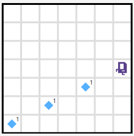

<hr />
<details>
<summary>Q4: Cleanup Karel, Milestone 2 - Spoiler: Tests failed like 🦾😀😂</summary>
<details open>
<summary>Description</summary>
Karel has a bit of spring cleaning to do! Karel's world will have beepers in some positions in the bottom row; write a program to have Karel walk across the bottom row and, at each position, pick up a beeper only if one is present. Notice that you've already written the code to check if a beeper is present and only pick up a beeper if one is there from the previous milestone -- you should use your code from the previous milestone as a helper function to help with the decomposition of this problem!

Additionally, note that Karel's starting position will never contain a beeper, so there's no need to check it.

For example, if this is the initial starting world, with some beepers in the first row:

<br />

<br />

This should be the end result, with a clear bottom row:

<br />

<br />

We've provided you two worlds on which to test your code. You can toggle between them by changing the very last line in the file from run_karel_program('Cleanup1.w') to run_karel_program('Cleanup2.w') (and vice versa) -- you will likely need to press Run (it's fine if you do so without any code written) for the world change to take effect.
</details>
<details>
<summary>Code</summary>

`CleanupKarel.py`
```python
from karel.stanfordkarel import *

"""
File: CleanupKarel.py
--------------------
When you finish writing this file, CleanupKarel should be able to
pick up all beepers from the first row of any sized world and
end in the bottom right corner facing East.
"""

def main():
    """
    You should write your code to make Karel do its task in
    this function. Make sure to delete the 'pass' line before
    starting to write your own code. You should also delete this
    comment and replace it with a better, more descriptive one.
    """
    while no_beepers_present():
        move()
        if beepers_present():
            while beepers_present():
                pick_beeper()

if __name__ == '__main__':
    run_karel_program('Cleanup1.w')
```

`Cleanup1.w`
```yaml
Dimension: (5, 5)
Beeper: (2, 1); 1
Beeper: (4, 1); 1
Beeper: (5, 1); 1
Karel: (1, 1); east
BeeperBag: 0
```

This code executed with no
evident drawback, but at submit time, it exploded 🦾😍:

```text
Test failed!
	Student program crashed with this error:
	File "/home/CleanupKarel.py", line 19, in main
	    if front_is_clear():
	KarelInfiniteException: Executed more than 20000 commands - Karel might be stuck in an infinite loop!
```

After a "little" logic improvement, it passed the tests:

`CleanupKarel.py`
```python
while front_is_clear():
        move()
        if beepers_present():
            while beepers_present():
                pick_beeper()
```

`Cleanup2.w`
```yaml
Dimension: (7, 4)
Beeper: (2, 1); 1
Beeper: (5, 1); 1
Beeper: (3, 1); 1
Beeper: (7, 1); 1
Karel: (1, 1); east
BeeperBag: 0
```
</details>
</details>

<hr />
<details>
<summary>Q5: Ramp Climbing Karel - Spoiler: Tests failed like 🦾😳😂 here too</summary>
<details open>
<summary>Description</summary>
Write a program that has Karel draw a diagonal line across the world, with a slope of ½, like so:

<br />

<br />

The key to drawing a diagonal line with slope ½ is to move two steps forward and one step up between each beeper. In this problem you can and should assume that the world is an odd number of columns across. Solving the problem for even columns as well is much harder and would count as an "extension".

You should assume

- Karel always begins at the bottom left corner of and empty world facing East.
- You may assume that the world is an odd number of columns across
- Karel's bag has infinite beepers.
- It does not matter which direction Karel ends up facing.
- The world is always square (the world's height is the same as its width)

We've provided you three worlds on which to test your code. You can toggle between them by changing the very last line in the file from run_karel_program('RampKarel1.w') to run_karel_program('RampKarel2.w') or run_karel_program('RampKarel3.w') -- you will likely need to press Run (it's fine if you do so without any code written) for the world change to take effect. RampKarel1 is a 7x7 world, RampKarel2 is a 3x3 world, and RampKarel3 is a 25x25 world.
</details>
<details>
<summary>Code</summary>

`RampClimbingKarel.py`
```python
from karel.stanfordkarel import *

"""
File: RampClimbingKarel.py
--------------------
When you finish writing this file, RampClimbingKarel should be
able to draw a line with slope 1/2 in any odd sized world
"""

def main():
    """
    You should write your code to make Karel do its task in
    this function. Make sure to delete the 'pass' line before
    starting to write your own code. You should also delete this
    comment and replace it with a better, more descriptive one.
    """
    while front_is_clear():
        pump_up_the_volume()

def pump_up_the_volume():
    put_beeper()
    double_move()
    turn_left()
    move()
    turn_right()

def turn_right():
    turn_left()
    turn_left()
    turn_left()

def double_move():
    move()
    move()


if __name__ == '__main__':
    run_karel_program('RampKarel1.w')
```

Not too surprisingly, this code had a hiccup too.

At first, the returned message looked a bit cryptic:

```text
Test failed!

BEEPERS: (7, 4) had 0, expected 1
```

🤔

Checking better, I forgot to put the last `beeper`:



Let's fix that:

`RampClimbingKarel.py`
```python
def main():
    while front_is_clear():
        pump_up_the_volume()
    put_beeper()
```

✅

`RampKarel1.w`
```yaml
Dimension: (7, 7)
BeeperBag: INFINITY
```

`RampKarel2.w`
```yaml
Dimension: (3, 3)
BeeperBag: INFINITY
```

`RampKarel3.w`
```yaml
Dimension: (25, 25)
BeeperBag: INFINITY
```
</details>
</details>

<hr />
<details>
<summary>Q6: Stone Mason Karel</summary>
<details open>
<summary>Description</summary>
Your next task is to repair the damage done to the Stanford Main Quad in the 1989 Loma Prieta earthquake. In particular, Karel should repair a set of arches where some of the stones (represented by beepers, of course) are missing from the columns supporting the arches, as illustrated in the figure below.

<br />

<br />

Your program should work on the world shown above, but it should be general enough to handle any world that meets the basic conditions outlined at the end of this problem.

<b>There are three example worlds here, and your program should work correctly in all of them.</b> You can toggle between them by changing the very last line in the file from run_karel_program('SampleQuad1.w') to run_karel_program('SampleQuad2.w') or run_karel_program('SampleQuad3.w') -- you will likely need to press Run (it's fine if you do so without any code written) for the world change to take effect.


When Karel is done, the missing stones in the columns should be replaced by beepers, so that the final picture resulting from the initial world shown in Figure 5 would look like the illustration below.

<br />

<br />

Karel’s final location and the final direction Karel is facing at the end of the run do not matter. Karel may count on the following facts about the world:

- Karel starts at the corner where 1st Avenue and 1st Street meet, facing east, with an infinite number of beepers in Karel’s beeper bag. The first column should be built on 1st Avenue.
- The columns are always exactly four Avenues apart, so they would be built on 1st Avenue, 5th Avenue, 9th Avenue, and so on.
- The final column will always have a wall immediately after it. Although this wall appears after 13th Avenue in the example figure, your program should work for any number of beeper columns.
- The top of a beeper column will always be marked by a wall. However, Karel cannot assume that columns are always five units high, or even that all columns within a given world are the same height.
- In an initial world, some columns may already contain beepers representing stones that are still in place. Your program should not put a second beeper on corners that already have beepers. Avenues that will not have columns will never contain existing beepers

</details>
<details>
<summary>Code</summary>

To my sadness, this passed the tests with no problems 🙀😁

`StoneMasonKarel.py`
```python
from karel.stanfordkarel import *

"""
File: StoneMasonKarel.py
------------------------
When you finish writing code in this file, StoneMasonKarel should be
able to solve the "repair the quad" problem from Assignment 1.
You should make sure that your program works for all of the
sample worlds supplied in the starter folder.
"""

def main():
    """
    You should write your code to make Karel do its task in
    this function. Make sure to delete the 'pass' line before
    starting to write your own code. You should also delete this
    comment and replace it with a better, more descriptive one.
    """
    while front_is_clear():
        logic_not_so_logic()
    pave_the_path_to_success()
    back_to_the_solid_foundation()

def pave_the_path_to_success():
    # while front_is_clear():
    if no_beepers_present():
        put_beeper()
    turn_left()
    while front_is_clear():
        move()
        while no_beepers_present():
            put_beeper()

def logic_not_so_logic():
    pave_the_path_to_success()
    back_to_the_solid_foundation()
    move_through_avenues()

def turn_around():
    turn_left()
    turn_left()

def turn_right():
    turn_left()
    turn_left()
    turn_left()

def back_to_the_solid_foundation():
    turn_around()
    while front_is_clear():
        move()
    turn_left()

def move_through_avenues():
    move()
    move()
    move()
    move()

if __name__ == '__main__':
    run_karel_program('SampleQuad1.w')
```

`SampleQuad1.w`
```yaml
Dimension: (13, 8)
Beeper: (1, 4); 1
Beeper: (1, 5); 1
Wall: (1, 6); South
Wall: (2, 6); West
Wall: (2, 7); South
Wall: (3, 7); West
Wall: (3, 8); South
Wall: (4, 7); West
Wall: (4, 7); South
Beeper: (5, 1); 1
Beeper: (5, 2); 1
Beeper: (5, 4); 1
Wall: (5, 6); West
Wall: (5, 6); South
Wall: (6, 6); West
Wall: (6, 7); South
Wall: (7, 7); West
Wall: (7, 8); South
Wall: (8, 7); West
Wall: (8, 7); South
Beeper: (9, 3); 1
Beeper: (9, 5); 1
Wall: (9, 6); West
Wall: (9, 6); South
Wall: (10, 6); West
Wall: (10, 7); South
Wall: (11, 7); West
Wall: (11, 8); South
Wall: (12, 7); West
Wall: (12, 7); South
Beeper: (13, 1); 1
Beeper: (13, 3); 1
Beeper: (13, 5); 1
Wall: (13, 6); West
Wall: (13, 6); South
BeeperBag: INFINITY
Karel: (1, 1); East
Speed: 0.5

```

`SampleQuad2.w`
```yaml
Dimension: (13, 9)
Beeper: (1, 1); 1
Beeper: (1, 2); 1
Wall: (1, 4); South
Wall: (2, 4); West
Wall: (2, 5); South
Wall: (3, 4); West
Wall: (3, 4); South
Wall: (4, 4); West
Wall: (4, 5); South
Beeper: (5, 1); 1
Wall: (5, 5); West
Beeper: (5, 5); 1
Wall: (5, 6); South
Wall: (6, 5); West
Wall: (6, 5); South
Wall: (7, 4); West
Wall: (7, 4); South
Wall: (8, 3); West
Wall: (8, 3); South
Wall: (9, 2); West
Wall: (9, 2); South
Wall: (10, 2); West
Wall: (10, 3); South
Wall: (11, 3); West
Wall: (11, 4); South
Wall: (12, 4); West
Wall: (12, 5); South
Beeper: (13, 1); 1
Beeper: (13, 3); 1
Wall: (13, 4); West
Wall: (13, 4); South
BeeperBag: INFINITY
Karel: (1, 1); East
Speed: 0.5
```

`SampleQuad3.w`
```yaml
Dimension: (5, 7)
Wall: (4, 5); west
Wall: (2, 5); south
Wall: (5, 2); south
Wall: (4, 3); east
Wall: (3, 5); north
Wall: (2, 4); west
Wall: (1, 3); north
Wall: (3, 5); west
Wall: (5, 2); west
Wall: (4, 4); west
Wall: (4, 3); north
Beeper: (5, 1); 1
Beeper: (1, 2); 1
Karel: (1, 1); east
BeeperBag: INFINITY
```

</details>
</details>

<hr />
<details>
<summary>Q7: Midpoint (optional!) 💣</summary>
<details open>
<summary>Description</summary>
As an exercise in solving algorithmic problems, program Karel to place a single beeper at the middle of 1st Street (aka Row). For example, say Karel starts in the 5x5 world pictured in the figure:

<br />

<br />

Karel should end with Karel standing on a beeper in the following position:

<br />

<br />

Note that the final configuration of the world should have only a single beeper at the midpoint of 1st Street. Along the way, Karel is allowed to place additional beepers wherever it wants to, but must pick them all up again before it finishes. Similarly, if Karel paints/colors any of the corners in the world, they must all be uncolored before Karel finishes.

In solving this problem, you may count on the following facts about the world:

- Karel starts at the bottom left corner, facing east, with an infinite number of beepers in its bag.
- The initial state of the world includes no interior walls or beepers.
- The world need not be square, but you may assume that it is at least as tall as it is wide.

Your program, moreover, can assume the following simplifications:

- If the width of the world is odd, Karel must put the beeper in the center square. If the width is even, Karel may drop the beeper on either of the two center squares.
- It does not matter which direction Karel is facing at the end of the run.

There are many different algorithms you can use to solve this problem so feel free to be creative!

You should make sure your program runs successfully in all of the following worlds (which are just a few different examples to test out the generality of your solution): Midpoint.w (default world), `Midpoint1.w`, `Midpoint2.w`, `Midpoint8.w` .

You can toggle between worlds by changing `Midpoint.w` in the last line of the file (which is currently `run_karel_program`('Midpoint.w') to the filename of your choice (make sure to include the quotation marks around the filename) and running your program.
</details>
<details>
<summary>Code</summary>

<details>
<summary>Python File</summary>

Annnnd now... the most awaited case 🥁

`Midpoint.py`
```python
from karel.stanfordkarel import *

"""
File: Midpoint.py
------------------------
Place a beeper on the middle of the first row.
"""

def main():
    """
    Your code here
    """
    # 1 BLACK
    paint_corner(BLACK)
    if front_is_blocked():
        put_beeper()
        paint_corner(BLANK)

    # 2 BLUE
    move()
    paint_corner(BLUE)
    if front_is_blocked():
        put_beeper()
        paint_corner(BLANK)
        turn_around()
        while front_is_clear():
            move()
            paint_corner(BLANK)

    # 3 CYAN
    move()
    paint_corner(CYAN)
    if front_is_blocked():
        paint_corner(BLANK)
        turn_around()
        while front_is_clear():
            move()
            if corner_color_is(BLUE):
                put_beeper()
            paint_corner(BLANK)

    # 4 DARK_GRAY
    move()
    paint_corner(DARK_GRAY)
    if front_is_blocked():
        paint_corner(BLANK)
        turn_around()
        while front_is_clear():
            move()
            if corner_color_is(CYAN):
                put_beeper()
            paint_corner(BLANK)

    # 5 GRAY
    move()
    paint_corner(GRAY)
    if front_is_blocked():
        paint_corner(BLANK)
        turn_around()
        while front_is_clear():
            move()
            if corner_color_is(GRAY):
                put_beeper()
            paint_corner(BLANK)

    # 6 GREEN
    move()
    paint_corner(GREEN)
    if front_is_blocked():
        paint_corner(BLANK)
        turn_around()
        while front_is_clear():
            move()
            if corner_color_is(CYAN):
                put_beeper()
            paint_corner(BLANK)

    # 7 LIGHT_GRAY
    move()
    paint_corner(LIGHT_GRAY)
    if front_is_blocked():
        paint_corner(BLANK)
        turn_around()
        while front_is_clear():
            move()
            if corner_color_is(DARK_GRAY):
                put_beeper()
            paint_corner(BLANK)

    # 8 MAGENTA
    move()
    paint_corner(MAGENTA)
    if front_is_blocked():
        paint_corner(BLANK)
        turn_around()
        while front_is_clear():
            move()
            if corner_color_is(GRAY):
                put_beeper()
            paint_corner(BLANK)

    # 9 ORANGE
    move()
    paint_corner(ORANGE)
    if front_is_blocked():
        paint_corner(BLANK)
        turn_around()
        while front_is_clear():
            move()
            if corner_color_is(GRAY):
                put_beeper()
            paint_corner(BLANK)

    # 10 PINK
    move()
    paint_corner(PINK)
    if front_is_blocked():
        paint_corner(BLANK)
        turn_around()
        while front_is_clear():
            move()
            if corner_color_is(GREEN):
                put_beeper()
            paint_corner(BLANK)

    # 11 RED
    move()
    paint_corner(RED)
    if front_is_blocked():
        paint_corner(BLANK)
        turn_around()
        while front_is_clear():
            move()
            if corner_color_is(GREEN):
                put_beeper()
            paint_corner(BLANK)

    # 12 WHITE
    move()
    paint_corner(WHITE)
    if front_is_blocked():
        paint_corner(BLANK)
        turn_around()
        while front_is_clear():
            move()
            if corner_color_is(LIGHT_GRAY):
                put_beeper()
            paint_corner(BLANK)

    # 13 YELLOW
    move()
    paint_corner(YELLOW)
    if front_is_blocked():
        paint_corner(BLANK)
        turn_around()
        while front_is_clear():
            move()
            if corner_color_is(LIGHT_GRAY):
                put_beeper()
            paint_corner(BLANK)

def turn_around():
   turn_left()
   turn_left()

if __name__ == '__main__':
    run_karel_program('Midpoint3.w')
```

<b>YES!</b>. This failed.

```text
Test failed!
	Student program crashed with this error:
	File "/home/Midpoint.py", line 115, in main
	    move()
	KarelCrashException: Karel crashed while on avenue 1 and street 1, facing West
	Invalid action: Karel attempted to move, but its front was blocked.
```

NOTE: will come back to this later!

</details>
<details>
<summary>Midpoint Files</summary>

`Midpoint1.w`
```yaml
Dimension: (1, 1)
BeeperBag: INFINITY
Karel: (1, 1); East
Speed: 0.75
```

`Midpoint2.w`
```yaml
Dimension: (2, 2)
Karel: (1, 1); east
BeeperBag: INFINITY
```

`Midpoint3.w`
```yaml
Dimension: (3, 2)
Karel: (1, 1); east
BeeperBag: INFINITY
```

`Midpoint4.w`
```yaml
Dimension: (4, 2)
Karel: (1, 1); east
BeeperBag: INFINITY
```

`Midpoint5.w`
```yaml
Dimension: (5, 10)
Karel: (1, 1); east
BeeperBag: INFINITY
```

`Midpoint6.w`
```yaml
Dimension: (6, 10)
Karel: (1, 1); east
BeeperBag: INFINITY
```

`Midpoint7.w`
```yaml
Dimension: (7, 10)
Karel: (1, 1); east
BeeperBag: INFINITY
```

`Midpoint8.w`
```yaml
Dimension: (8, 10)
Karel: (1, 1); east
BeeperBag: INFINITY
```

`Midpoint.w`
```yaml
Dimension: (9, 9)
Karel: (1, 1); east
BeeperBag: INFINITY
```

`Midpoint10.w`
```yaml
Dimension: (10, 10)
Karel: (1, 1); east
BeeperBag: INFINITY
```

`Midpoint11.w`
```yaml
Dimension: (11, 10)
Karel: (1, 1); east
BeeperBag: INFINITY
```

`Midpoint12.w`
```yaml
Dimension: (12, 10)
Karel: (1, 1); east
BeeperBag: INFINITY
```

`Midpoint13.w`
```yaml
Dimension: (13, 10)
Karel: (1, 1); east
BeeperBag: INFINITY
```

</details>

</details>
</details>

<hr />
<details>
<summary>Extension (optional!)</summary>
<details open>
<summary>Description</summary>
If you finish early, you may optionally write a Karel project of your own choice. Modify this file to use Karel to complete any task of your choosing! Extensions are a great chance for practice and to be creative. Make sure to write comments to explain what your program is doing and update the world to be appropriate for your program. (Notice that you can toggle the rows and columns of Karel's world, and if you right click Karel's world, you'll see a dropdown of other things you can do by clicking!)
</details>
<details>
<summary>Code</summary>

`ExtensionKarel.py`
```python
from karel.stanfordkarel import *

"""
File: ExtensionKarel.py
-----------------------
This file is for optional extension programs.
"""

def main():
    """
    You should write your code to make Karel do its task in
    this function. Make sure to delete the 'pass' line before
    starting to write your own code. You should also delete this
    comment and replace it with a better, more descriptive one.
    """
    crazy_swing()

def turn_right():
    turn_left()
    turn_left()
    turn_left()

def crazy_swing():
    while no_beepers_present():
        if front_is_clear():
            move()
            turn_right()
            if front_is_clear():
                move()
            turn_left()
            if front_is_clear():
                move()
        else:
            turn_left()
            turn_left()
            turn_right()

if __name__ == "__main__":
    run_karel_program()
```

</details>
</details>
