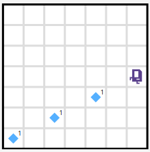

# Lesson 3: Decomposition (aka Refinement) April 23st

<details open>
<summary>Learning Goals</summary>
<br />

Learn how to use for loops to repeat a block of code a fixed number of times. Learn to use a while loop to repeat a block of code, checking on a condition before each repetition. Learn to use an if statement which only executes a block of code 'if' a given condition passes!
</details>

 ## Videos

- [x] Decomposition ✂️
- [x] Morning
- [x] Mountain 🏔️
- [x] Rhoomba

<details>
<summary>Roomba.py</summary>
<details open>
<summary>Description</summary>
Karel picks up all the beepers in the world.
<br />

<br />

</details>
<details>
<summary>Code</summary>

`Roomba.py`
```python
from karel.stanfordkarel import *

"""
File: Roomba.py
----------------------------
Karel picks up all the beepers in the world.
"""

def main():
    while left_is_clear():
        """
        pre - Karel is facing east at the
        start of a row
        """
        clear_row()
        move_to_wall()
        next_row()
        """
        post - Karel is facing east at the
        start of the next row
        """
    clear_row()

# Removes all beepers from one row
def clear_row():
    while front_is_clear():
        safe_pick()
        move()
    safe_pick()

# Picks up a beeper... if there is one!
def safe_pick():
    if beepers_present():
        pick_beeper()

# Karel moves up one row. Facing east pre + post
def next_row():
    turn_around()
    move_to_wall()
    turn_right()
    move()
    turn_right()

# Move until Karel hits a wall
def move_to_wall():
    while front_is_clear():
        move()

# If only Karel knew by default
def turn_around():
    for i in range(2):
        turn_left()

# Recall, not an ambi turner
def turn_right():
    for i in range(3):
        turn_left()

if __name__ == "__main__":
    run_karel_program("Roomba1")
```

`Roomba1.w`
```yaml
Dimension: (8, 8)
BeeperBag: INFINITY
Karel: (1, 1); East
Speed: 0.75
Beeper: (1, 7); 1
Beeper: (2, 1); 1
Beeper: (5, 1); 1
Beeper: (7, 1); 1
Beeper: (8, 1); 1
Beeper: (1, 2); 1
Beeper: (3, 3); 1
Beeper: (2, 6); 1
Beeper: (5, 4); 1
Beeper: (7, 8); 1
Beeper: (8, 7); 1
```

TODO: check the following world:

- equal to first
- it clears all beepers at the beginning

`Roomba2.w`
```yaml
Dimension: (8, 8)
BeeperBag: INFINITY
Karel: (1, 1) East
Speed: 0.75
Beeper: (1, 7) 1
Beeper: (2, 1) 1
Beeper: (5, 1) 1
Beeper: (7, 1) 1
Beeper: (8, 1) 1
Beeper: (1, 2) 1
Beeper: (3, 3) 3
Beeper: (2, 6) 1
Beeper: (5, 4) 1
Beeper: (7, 8) 1
Beeper: (8, 7) 1
```

</details>
</details>
<hr />

- [x] Word Search

## Assignments Problems

<details>
<summary>Q5: Ramp Climbing Karel - Spoiler: Tests failed like 🦾😳😂 here too</summary>
<details open>
<summary>Description</summary>
Write a program that has Karel draw a diagonal line across the world, with a slope of ½, like so:

<br />

<br />

The key to drawing a diagonal line with slope ½ is to move two steps forward and one step up between each beeper. In this problem you can and should assume that the world is an odd number of columns across. Solving the problem for even columns as well is much harder and would count as an "extension".

You should assume

- Karel always begins at the bottom left corner of and empty world facing East.
- You may assume that the world is an odd number of columns across
- Karel's bag has infinite beepers.
- It does not matter which direction Karel ends up facing.
- The world is always square (the world's height is the same as its width)

We've provided you three worlds on which to test your code. You can toggle between them by changing the very last line in the file from run_karel_program('RampKarel1.w') to run_karel_program('RampKarel2.w') or run_karel_program('RampKarel3.w') -- you will likely need to press Run (it's fine if you do so without any code written) for the world change to take effect. RampKarel1 is a 7x7 world, RampKarel2 is a 3x3 world, and RampKarel3 is a 25x25 world.
</details>
<details>
<summary>Code</summary>

`RampClimbingKarel.py`
```python
from karel.stanfordkarel import *

"""
File: RampClimbingKarel.py
--------------------
When you finish writing this file, RampClimbingKarel should be
able to draw a line with slope 1/2 in any odd sized world
"""

def main():
    """
    You should write your code to make Karel do its task in
    this function. Make sure to delete the 'pass' line before
    starting to write your own code. You should also delete this
    comment and replace it with a better, more descriptive one.
    """
    while front_is_clear():
        pump_up_the_volume()

def pump_up_the_volume():
    put_beeper()
    double_move()
    turn_left()
    move()
    turn_right()

def turn_right():
    turn_left()
    turn_left()
    turn_left()

def double_move():
    move()
    move()


if __name__ == '__main__':
    run_karel_program('RampKarel1.w')
```

Not too surprisingly, this code had a hiccup too.

At first, the returned message looked a bit cryptic:

```text
Test failed!

BEEPERS: (7, 4) had 0, expected 1
```

🤔

Checking better, I forgot to put the last `beeper`:



Let's fix that:

`RampClimbingKarel.py`
```python
def main():
    while front_is_clear():
        pump_up_the_volume()
    put_beeper()
```

✅

`RampKarel1.w`
```yaml
Dimension: (7, 7)
BeeperBag: INFINITY
```

`RampKarel2.w`
```yaml
Dimension: (3, 3)
BeeperBag: INFINITY
```

`RampKarel3.w`
```yaml
Dimension: (25, 25)
BeeperBag: INFINITY
```
</details>
</details>

<hr />
<details>
<summary>Q6: Stone Mason Karel</summary>
<details open>
<summary>Description</summary>
Your next task is to repair the damage done to the Stanford Main Quad in the 1989 Loma Prieta earthquake. In particular, Karel should repair a set of arches where some of the stones (represented by beepers, of course) are missing from the columns supporting the arches, as illustrated in the figure below.

<br />

<br />

Your program should work on the world shown above, but it should be general enough to handle any world that meets the basic conditions outlined at the end of this problem.

<b>There are three example worlds here, and your program should work correctly in all of them.</b> You can toggle between them by changing the very last line in the file from run_karel_program('SampleQuad1.w') to run_karel_program('SampleQuad2.w') or run_karel_program('SampleQuad3.w') -- you will likely need to press Run (it's fine if you do so without any code written) for the world change to take effect.


When Karel is done, the missing stones in the columns should be replaced by beepers, so that the final picture resulting from the initial world shown in Figure 5 would look like the illustration below.

<br />

<br />

Karel’s final location and the final direction Karel is facing at the end of the run do not matter. Karel may count on the following facts about the world:

- Karel starts at the corner where 1st Avenue and 1st Street meet, facing east, with an infinite number of beepers in Karel’s beeper bag. The first column should be built on 1st Avenue.
- The columns are always exactly four Avenues apart, so they would be built on 1st Avenue, 5th Avenue, 9th Avenue, and so on.
- The final column will always have a wall immediately after it. Although this wall appears after 13th Avenue in the example figure, your program should work for any number of beeper columns.
- The top of a beeper column will always be marked by a wall. However, Karel cannot assume that columns are always five units high, or even that all columns within a given world are the same height.
- In an initial world, some columns may already contain beepers representing stones that are still in place. Your program should not put a second beeper on corners that already have beepers. Avenues that will not have columns will never contain existing beepers

</details>
<details>
<summary>Code</summary>

To my sadness, this passed the tests with no problems 🙀😁

`StoneMasonKarel.py`
```python
from karel.stanfordkarel import *

"""
File: StoneMasonKarel.py
------------------------
When you finish writing code in this file, StoneMasonKarel should be
able to solve the "repair the quad" problem from Assignment 1.
You should make sure that your program works for all of the
sample worlds supplied in the starter folder.
"""

def main():
    """
    You should write your code to make Karel do its task in
    this function. Make sure to delete the 'pass' line before
    starting to write your own code. You should also delete this
    comment and replace it with a better, more descriptive one.
    """
    while front_is_clear():
        logic_not_so_logic()
    pave_the_path_to_success()
    back_to_the_solid_foundation()

def pave_the_path_to_success():
    # while front_is_clear():
    if no_beepers_present():
        put_beeper()
    turn_left()
    while front_is_clear():
        move()
        while no_beepers_present():
            put_beeper()

def logic_not_so_logic():
    pave_the_path_to_success()
    back_to_the_solid_foundation()
    move_through_avenues()

def turn_around():
    turn_left()
    turn_left()

def turn_right():
    turn_left()
    turn_left()
    turn_left()

def back_to_the_solid_foundation():
    turn_around()
    while front_is_clear():
        move()
    turn_left()

def move_through_avenues():
    move()
    move()
    move()
    move()

if __name__ == '__main__':
    run_karel_program('SampleQuad1.w')
```

`SampleQuad1.w`
```yaml
Dimension: (13, 8)
Beeper: (1, 4); 1
Beeper: (1, 5); 1
Wall: (1, 6); South
Wall: (2, 6); West
Wall: (2, 7); South
Wall: (3, 7); West
Wall: (3, 8); South
Wall: (4, 7); West
Wall: (4, 7); South
Beeper: (5, 1); 1
Beeper: (5, 2); 1
Beeper: (5, 4); 1
Wall: (5, 6); West
Wall: (5, 6); South
Wall: (6, 6); West
Wall: (6, 7); South
Wall: (7, 7); West
Wall: (7, 8); South
Wall: (8, 7); West
Wall: (8, 7); South
Beeper: (9, 3); 1
Beeper: (9, 5); 1
Wall: (9, 6); West
Wall: (9, 6); South
Wall: (10, 6); West
Wall: (10, 7); South
Wall: (11, 7); West
Wall: (11, 8); South
Wall: (12, 7); West
Wall: (12, 7); South
Beeper: (13, 1); 1
Beeper: (13, 3); 1
Beeper: (13, 5); 1
Wall: (13, 6); West
Wall: (13, 6); South
BeeperBag: INFINITY
Karel: (1, 1); East
Speed: 0.5

```

`SampleQuad2.w`
```yaml
Dimension: (13, 9)
Beeper: (1, 1); 1
Beeper: (1, 2); 1
Wall: (1, 4); South
Wall: (2, 4); West
Wall: (2, 5); South
Wall: (3, 4); West
Wall: (3, 4); South
Wall: (4, 4); West
Wall: (4, 5); South
Beeper: (5, 1); 1
Wall: (5, 5); West
Beeper: (5, 5); 1
Wall: (5, 6); South
Wall: (6, 5); West
Wall: (6, 5); South
Wall: (7, 4); West
Wall: (7, 4); South
Wall: (8, 3); West
Wall: (8, 3); South
Wall: (9, 2); West
Wall: (9, 2); South
Wall: (10, 2); West
Wall: (10, 3); South
Wall: (11, 3); West
Wall: (11, 4); South
Wall: (12, 4); West
Wall: (12, 5); South
Beeper: (13, 1); 1
Beeper: (13, 3); 1
Wall: (13, 4); West
Wall: (13, 4); South
BeeperBag: INFINITY
Karel: (1, 1); East
Speed: 0.5
```

`SampleQuad3.w`
```yaml
Dimension: (5, 7)
Wall: (4, 5); west
Wall: (2, 5); south
Wall: (5, 2); south
Wall: (4, 3); east
Wall: (3, 5); north
Wall: (2, 4); west
Wall: (1, 3); north
Wall: (3, 5); west
Wall: (5, 2); west
Wall: (4, 4); west
Wall: (4, 3); north
Beeper: (5, 1); 1
Beeper: (1, 2); 1
Karel: (1, 1); east
BeeperBag: INFINITY
```

</details>
</details>
<hr />

## Optional Worked Examples

- [x] [Control Flow Examples](https://edstem.org/us/courses/10000/lessons/12449/slides/60969)

 ## Optonal Related Reading

- [ ] [Lecture Slides](https://codeinplace2020.github.io/faqs/3-Decomposition.pdf)
- [ ] [Refinement](https://compedu.stanford.edu/karel-reader/docs/python/en/chapter8.html)