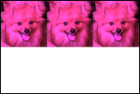

# Lesson 9: Images May 7th

<details open>
<summary>Learning Goals</summary>
<br />
Learn how work with images in python 🏟️😍
</details>

 ## Videos

- [x] Intro
- [x] SimpleImage

- [x] Image Examples

<details>
<summary>imageexamples.py</summary>

`imageexamples.py`
```python
"""
This program contains several examples of functions that
manipulate an image to show how the SimpleImage library works.
"""

from simpleimage import SimpleImage


def darker(image):
    """
    Makes image passed in darker by halving red, green, blue values.
    Note: changes in image persist after function ends.
    """
    # Demonstrate looping over all the pixels of an image,
    # changing each pixel to be half its original intensity.
    for pixel in image:
        pixel.red = pixel.red // 2
        pixel.green = pixel.green // 2
        pixel.blue = pixel.blue // 2


def red_channel(filename):
    """
    Reads image from file specified by filename.
    Changes the image as follows:
    For every pixel, set green and blue values to 0
    yielding the red channel.
    Return the changed image.
    """
    image = SimpleImage(filename)
    for pixel in image:
        pixel.green = 0
        pixel.blue = 0
    return image


def compute_luminosity(red, green, blue):
    """
    Calculates the luminosity of a pixel using NTSC formula
    to weight red, green, and blue values appropriately.
    """
    return (0.299 * red) + (0.587 * green) + (0.114 * blue)


def grayscale(filename):
    """
    Reads image from file specified by filename.
    Change the image to be grayscale using the NTSC
    luminosity formula and return it.
    """
    image = SimpleImage(filename)
    for pixel in image:
        luminosity = compute_luminosity(pixel.red, pixel.green, pixel.blue)
        pixel.red = luminosity
        pixel.green = luminosity
        pixel.blue = luminosity
    return image


def main():
    """
    Run your desired image manipulation functions here.
    You should store the return value (image) and then
    call .show() to visualize the output of your program.
    """
    flower = SimpleImage('flower.png')
    flower.show()

    darker(flower)
    flower.show()

    red_flower = red_channel('flower.png')
    red_flower.show()

    grayscale_flower = grayscale('flower.png')
    grayscale_flower.show()


if __name__ == '__main__':
    main()
```
</details>

- [x] Greenscreen

<details>
<summary>greenscreen.py</summary>

`greenscreen.py`
```python
"""
This program shows an example of "greenscreening" (actually
"redscreening" in this case).  This is where we replace the
pixels of a certain color intensity in a particular channel
(here, we use red) with the pixels from another image.
"""

from simpleimage import SimpleImage

INTENSITY_THRESHOLD = 1.6


def redscreen(main_filename, back_filename):
    """
    Implements the notion of "redscreening".  That is,
    the image in the main_filename has its "sufficiently red"
    pixels replaced with pixel from the corresponding x,y
    location in the image in the file back_filename.
    Returns the resulting "redscreened" image.
    """
    image = SimpleImage(main_filename)
    back = SimpleImage(back_filename)
    for pixel in image:
        average = (pixel.red + pixel.green + pixel.blue) // 3
        # See if this pixel is "sufficiently" red
        if pixel.red >= average * INTENSITY_THRESHOLD:
            # If so, we get the corresponding pixel from the
            # back image and overwrite the pixel in
            # the main image with that from the back image.
            x = pixel.x
            y = pixel.y
            image.set_pixel(x, y, back.get_pixel(x, y))
    return image


def main():
    """
    Run your desired image manipulation functions here.
    You should store the return value (image) and then
    call .show() to visualize the output of your program.
    """
    original_stop = SimpleImage('stop.png')
    original_stop.show()

    original_leaves = SimpleImage('leaves.png')
    original_leaves.show()

    stop_leaves_replaced = redscreen('stop.png', 'leaves.png')
    stop_leaves_replaced.show()


if __name__ == '__main__':
    main()
```
</details>

- [x] Mirror

<details>
<summary>Code</summary>

`mirror.py`
```python
"""
File: mirror.py
---------------
This program shows an example of creating an image
that shows an original image and its mirror reflection
in a new image.
"""

from simpleimage import SimpleImage


def mirror_image(filename):
    """
    Read an image from the file specified by filename.
    Returns a new images that includes the original image
    and its mirror reflection.
    Returns the resulting "redscreened" image.
    """
    image = SimpleImage(filename)
    width = image.width
    height = image.height

    # Create new image to contain mirror reflection
    mirror = SimpleImage.blank(width * 2, height)

    for y in range(height):
        for x in range(width):
            pixel = image.get_pixel(x, y)
            mirror.set_pixel(x, y, pixel)
            mirror.set_pixel((width * 2) - (x + 1), y, pixel)
    return mirror


def main():
    """
    Run your desired image manipulation functions here.
    You should store the return value (image) and then
    call .show() to visualize the output of your program.
    """
    original = SimpleImage('burrito.jpg')
    original.show()

    mirrored = mirror_image('burrito.jpg')
    mirrored.show()


if __name__ == '__main__':
    main()
```
</details>

Variants:

<details>
<summary>mirror.py</summary>

`mirror.py`
```python
from simpleimage import SimpleImage
import random


def mirror_image(filename):
    """
    Read an image from the file specified by filename.
    Returns a new images that includes the original image
    and its mirror reflection.
    Returns the resulting "redscreened" image.
    """
    image = SimpleImage(filename)
    width = image.width
    height = image.height

    # Create new image to contain mirror reflection
    mirror = SimpleImage.blank(width * 2, height)

    for y in range(height):
        for x in range(width):
            pixel = image.get_pixel(x, y)
            mirror.set_pixel(x, y, pixel)
            pixel.red = random.randint(pixel.red // (x + 1), pixel.red)
            pixel.green = random.randint(pixel.green // 2, pixel.green * 3)
            pixel.blue = random.randint(pixel.blue // 2, pixel.blue)
            # mirror.set_pixel((width * 2) - (x + 100), y, pixel)
            if x % 2 == 0:
                pixel.red = 0
                pixel.green = 0
                pixel.blue = 0
                mirror.set_pixel((width * 2) -
                    (x + random.randint(100, height)), y, pixel)
            else:
                # mirror.set_pixel((width * 2) -
                    # (x + random.randint(100, height)), y, pixel)
                mirror.set_pixel((width * 2) - (x + 1), y, pixel)

            # Original
            # pixel.blue = pixel.red // 2
            # pixel.blue = pixel.green // 2
            # pixel.blue = pixel.blue // 2
            # mirror.set_pixel((width * 2) - (x + 1), y, pixel)
    return mirror
```
</details>

- [x] Wrapup
- [x] Responsibility

## Assignments Problems

<details>
<summary>Q1: Code in Place Filter</summary>
<details open>
<summary>Description</summary>
Write a program that asks the user to enter an image file, loads that file and applies the “Code in Place” filter.

To apply the Code in Place filter, you are going to change every pixel to have the following new red, green and blue values, based off the pixels old red, green and blue values:

```python
new red value = old red value * 1.5
new green value = old green value * 0.7
new blue value = old blue value * 1.5
```

Problem written by Chris Piech. Inspired by image library and examples from Nick Parlante.
</details>
<details>
<summary>codeinplace_filter.py</summary>

`codeinplace_filter.py`
```python
"""
This program implements a rad image filter.
"""

from simpleimage import SimpleImage

DEFAULT_FILE = 'images/quad.jpg'


def main():
    # Get file name from user input
    filename = get_file()

    # Load image and show image before the transform
    image = SimpleImage(filename)
    image.show()

    # Apply the filter
    # TODO: your code here
    code_in_place_filter(image)

    # Show the image after the transform
    image.show()


def get_file():
    # Read image file path from user, or use the default file
    filename = input('Enter image file (or press enter for default): ')
    if filename == '':
        filename = DEFAULT_FILE
    return filename


def code_in_place_filter(image):
    for px in image:
        px.red = px.red * 1.5
        px.green = px.green * 0.7
        px.blue = px.blue * 1.5


if __name__ == '__main__':
    main()
```
</details>
</details>
<hr />

<details>
<summary>Q2: Finding Forest Flames</summary>
<details open>
<summary>Description</summary>
We’re going to start by writing a function called `find_flames` (in the file `forest_fire.py`) that highlights the areas where a forest fire is active. You’re given a satellite image of Greenland’s 2017 fires (photo credit: Stef Lhermitte, Delft University of Technology). Your job is to detect all of the “sufficiently red” pixels in the image, which are indicative of where fires are burning in the image. As we did in class with the “redscreening” example, we consider a pixel “sufficiently red” if its red value is greater than or equal to the average of the pixel’s three RGB values times a constant `INTENSITY_THRESHOLD`.

Recall that the average of a pixel, which has red, green and blue values is:

```python
average = (red + green + blue) / 3
```

Image

`Original forest fire image on left, and highlighted version of image on right.`

When you detect a “sufficiently red” pixel in the original image, you set its red value to 255 and its green and blue values to 0. This will highlight the pixel by making it entirely red. For all other pixels (i.e., those that are not “sufficiently red”), you should convert them to their grayscale equivalent, so that we can more easily see where the fire is originating from. You can grayscale a pixel by summing together its red, green, and blue values and dividing by three (finding the average), and then setting the pixel’s red, green, and blue values to all have this same “average” value.

Once you highlight the areas that are on fire in the image (and greyscale all the remaining pixels), you should see an image like that shown on the right in the figure. On the left side of the example image, we should the original image for comparison.

Note: to make this algorithm work on different images of fire, select an appropriate `INTENSITY_THRESHOLD` value.

`Problem written by Sonja Johnson-Yu.`

</details>
<details>
<summary>forest_fire.py</summary>

`forest_fire.py`
```python
"""
This program highlights fires in an image by identifying pixels
whose red intensity is more than INTENSITY_THRESHOLD times the
average of the red, green, and blue values at a pixel. Those
"sufficiently red" pixels are then highlighted in the image
and other pixels are turned grey, by setting the pixel red,
green, and blue values to be all the same average value.
"""

from simpleimage import SimpleImage

INTENSITY_THRESHOLD = 0.9923
# INTENSITY_THRESHOLD = 1.6
DEFAULT_FILE = 'images/greenland-fire.png'


def find_flames(filename):
    """
    This function should highlight the "sufficiently red" pixels
    in the image and grayscale all other pixels in the image
    in order to highlight areas of wildfires.
    """
    image = SimpleImage(filename)
    # TODO: your code here

    for px in image:
        average = (px.red + px.green + px.blue) / 3
        # pixel is “sufficiently red”
        if px.red >= (average * INTENSITY_THRESHOLD):
            px.red = 255
            px.green = 0
            px.blue = 0
        # pixel is not “sufficiently red”
        else:
            px.red = average
            px.green = average
            px.blue = average

    return image


def main():
    # Get file name from user input
    filename = get_file()

    # Show the original fire
    original_fire = SimpleImage(filename)
    original_fire.show()

    # Show the highlighted fire
    highlighted_fire = find_flames(filename)
    highlighted_fire.show()


def get_file():
    # Read image file path from user, or use the default file
    filename = input('Enter image file (or press enter for default): ')
    if filename == '':
        filename = DEFAULT_FILE
    return filename


if __name__ == '__main__':
    main()
```
</details>
</details>
<hr />

<details>
<summary>Q3 (optional; medium): Reflection</summary>
<details open>
<summary>Description</summary>
Write a function that returns an output image that is twice the height of the original. The top half of the output image should be identical to the original image. The bottom half, however, should look like a reflection of the top half. The highest row in the top half should be “reflected” to be the lowest row in the bottom half. This results in a cool effect.
</details>
<details>
<summary>reflection.py + simpleimage.py</summary>

`reflection.py`
```python
"""
This program takes an image and generates a reflection.
The top half of the generated image is the same as the original.
The bottom half is the mirror reflection of the top half.
"""

from simpleimage import SimpleImage

DEFAULT_FILE = 'images/mt-rainier.jpg'


def make_reflected(filename):
    image = SimpleImage(filename)
    # TODO: your code here.
    width = image.width
    height = image.height
    reflect = SimpleImage.blank(width, height * 2)
    # for y in range(height):
    #     for x in range(width):
    #         pixel = image.get_pixel(x, y)
    #         mirror.set_pixel(x, y, pixel)
    #         mirror.set_pixel((width) - (x + 1), y * 2, pixel)

    for x in range(width):
        #  loop over all the rows from y = 0
        for y in range(height):
            #  your code here
            pixel = image.get_pixel(x, y)
            #  draws original image
            reflect.set_pixel(x, y, pixel)
            #  draws the reflected image
            reflect.set_pixel(x, (height * 2) - (y + 1), pixel)
    return reflect


def main():
    # Get file name from user input
    filename = get_file()

    # Show the original image
    original = SimpleImage(filename)
    original.show()

    # Show the reflected image
    reflected = make_reflected(filename)
    reflected.show()


def get_file():
    # Read image file path from user, or use the default file
    filename = input('Enter image file (or press enter for default): ')
    if filename == '':
        filename = DEFAULT_FILE
    return filename


if __name__ == '__main__':
    main()
```
</details>
<details>
<summary>simpleimage.py</summary>

`simpleimage.py`
```python
#! /usr/bin/env python3

"""
Stanford CS106AP SimpleImage

Written by Nick Parlante, Sonja Johnson-Yu, and Nick Bowman.
 -7/2019  version, has file reading, pix, foreach, hidden get/setpix

SimpleImage Features:
Create image:
  image = SimpleImage.blank(400, 200)   # create new image of size
  image = SimpleImage('foo.jpg')        # create from file

Access size
  image.width, image.height

Get pixel at x,y
  pix = image.get_pixel(x, y)
  # pix is RGB tuple like (100, 200, 0)

Set pixel at x,y
  image.set_pixel(x, y, pix)   # set data by tuple also

Get Pixel object at x,y
  pixel = image.get_pixel(x, y)
  pixel.red = 0
  pixel.blue = 255

Show image on screen
  image.show()

The main() function below demonstrates the above functions as a test.
"""

import sys

# If the following line fails, "Pillow" needs to be installed
from PIL import Image

def clamp(num):
    """
    Return a "clamped" version of the given num,
    converted to be an int limited to the range 0..255 for 1 byte.
    """
    num = int(num)
    if num < 0:
        return 0
    if num >= 256:
        return 255
    return num


class Pixel(object):
    """
    A pixel at an x,y in a SimpleImage.
    Supports set/get .red .green .blue
    and get .x .y
    """
    def __init__(self, image, x, y):
        self.image = image
        self._x = x
        self._y = y

    def __str__(self):
        return 'r:' + str(self.red) + ' g:' + str(self.green) + ' b:' + str(self.blue)

    # Pillow image stores each pixel color as a (red, green, blue) tuple.
    # So the functions below have to unpack/repack the tuple to change anything.

    @property
    def red(self):
        return self.image.px[self._x, self._y][0]

    @red.setter
    def red(self, value):
        rgb = self.image.px[self._x, self._y]
        self.image.px[self._x, self._y] = (clamp(value), rgb[1], rgb[2])

    @property
    def green(self):
        return self.image.px[self._x, self._y][1]

    @green.setter
    def green(self, value):
        rgb = self.image.px[self._x, self._y]
        self.image.px[self._x, self._y] = (rgb[0], clamp(value), rgb[2])

    @property
    def blue(self):
        return self.image.px[self._x, self._y][2]

    @blue.setter
    def blue(self, value):
        rgb = self.image.px[self._x, self._y]
        self.image.px[self._x, self._y] = (rgb[0], rgb[1], clamp(value))

    @property
    def x(self):
        return self._x

    @property
    def y(self):
        return self._y


# color tuples for background color names 'red' 'white' etc.
BACK_COLORS = {
    'white': (255, 255, 255),
    'black': (0, 0, 0),
    'red': (255, 0, 0),
    'green': (0, 255, 0),
    'blue': (0, 0, 255),
}


class SimpleImage(object):
    def __init__(self, filename, width=0, height=0, back_color=None):
        """
        Create a new image. This case works: SimpleImage('foo.jpg')
        To create a blank image use SimpleImage.blank(500, 300)
        The other parameters here are for internal/experimental use.
        """
        # Create pil_image either from file, or making blank
        if filename:
            self.pil_image = Image.open(filename).convert("RGB")
            if self.pil_image.mode != 'RGB':
                raise Exception('Image file is not RGB')
            self._filename = filename  # hold onto
        else:
            if not back_color:
                back_color = 'white'
            color_tuple = BACK_COLORS[back_color]
            if width == 0 or height == 0:
                raise Exception('Creating blank image requires width/height but got {} {}'
                                .format(width, height))
            self.pil_image = Image.new('RGB', (width, height), color_tuple)
        self.px = self.pil_image.load()
        size = self.pil_image.size
        self._width = size[0]
        self._height = size[1]
        self.curr_x = 0
        self.curr_y = 0

    def __iter__(self):
        return self

    def __next__(self):
        if self.curr_x < self.width and self.curr_y < self.height:
            x = self.curr_x
            y = self.curr_y
            self.increment_curr_counters()
            return Pixel(self, x, y)
        else:
            self.curr_x = 0
            self.curr_y = 0
            raise StopIteration()

    def increment_curr_counters(self):
        self.curr_x += 1
        if self.curr_x == self.width:
            self.curr_x = 0
            self.curr_y += 1

    @classmethod
    def blank(cls, width, height, back_color=None):
        """Create a new blank image of the given width and height, optional back_color."""
        return SimpleImage('', width, height, back_color=back_color)

    @classmethod
    def file(cls, filename):
        """Create a new image based on a file, alternative to raw constructor."""
        return SimpleImage(filename)

    @property
    def width(self):
        """Width of image in pixels."""
        return self._width

    @property
    def height(self):
        """Height of image in pixels."""
        return self._height

    def get_pixel(self, x, y):
        """
        Returns a Pixel at the given x,y, suitable for getting/setting
        .red .green .blue values.
        """
        if x < 0 or x >= self._width or y < 0 or y >= self.height:
            e = Exception('get_pixel bad coordinate x %d y %d (vs. image width %d height %d)' %
                          (x, y, self._width, self.height))
            raise e
        return Pixel(self, x, y)

    def set_pixel(self, x, y, pixel):
        if x < 0 or x >= self._width or y < 0 or y >= self.height:
            e = Exception('set_pixel bad coordinate x %d y %d (vs. image width %d height %d)' %
                          (x, y, self._width, self.height))
            raise e
        self.px[x, y] = (pixel.red, pixel.green, pixel.blue)

    def set_rgb(self, x, y, red, green, blue):
        """
        Set the pixel at the given x,y to have
        the given red/green/blue values without
        requiring a separate pixel object.
        """
        self.px[x, y] = (red, green, blue)

    def _get_pix_(self, x, y):
        """Get pix RGB tuple (200, 100, 50) for the given x,y."""
        return self.px[x, y]

    def _set_pix_(self, x, y, pix):
        """Set the given pix RGB tuple into the image at the given x,y."""
        self.px[x, y] = pix

    def show(self):
        """Displays the image using an external utility."""
        self.pil_image.show()

    def make_as_big_as(self, image):
        """Resizes image to the shape of the given image"""
        self.pil_image = self.pil_image.resize((image.width, image.height))
        self.px = self.pil_image.load()
        size = self.pil_image.size
        self._width = size[0]
        self._height = size[1]


def main():
    """
    main() exercises the features as a test.
    1. With 1 arg like flowers.jpg - opens it
    2. With 0 args, creates a yellow square with
    a green stripe at the right edge.
    """
    args = sys.argv[1:]
    if len(args) == 1:
        image = SimpleImage.file(args[0])
        image.show()
        return

    # Create yellow rectangle, using foreach iterator
    image = SimpleImage.blank(400, 200)
    for pixel in image:
        pixel.red = 255
        pixel.green = 255
        pixel.blue = 0

    # for pixel in image:
    #     print(pixel)

    # Set green stripe using pix access.
    pix = image._get_pix_(0, 0)
    green = (0, pix[1], 0)
    for x in range(image.width - 10, image.width):
        for y in range(image.height):
            image._set_pix_(x, y, green)
    image.show()
    image.pil_image.save('file.png')


if __name__ == '__main__':
    main()
```
</details>
</details>
<hr />

<details>
<summary>Q4 (optional; hard): Warhol Effect</summary>
<details open>
<summary>Description</summary>
Write an algorithm that takes in a square patch like this photo of Simba the Dog:

<div>

</div>

And creates an image which has the patch copied 6 times (in 2 rows and 3 columns) where each patch gets re-colored. This effect is inspired by some of Andy Warhol’s paintings.

<div>

</div>

We strongly recommend implementing a function, like so:

```python
def make_recolored_patch(red_scale, green_scale, blue_scale):
```

Which returns a new colored patch. See the starter code for details.

Don’t try to match the colors in this example exactly. Experiment with different combinations of red_scale, green_scale and blue_scale. The pink Simba was generated by

```python
make_recolored_patch(1.5, 0, 1.5)
```

A few milestones:

<div>

</div>

<div>

</div>

Define other functions too! How about a function which adds a colored patch to the final_image at a given row, column?

```
Problem written by Chris Piech. Inspired by a problem called "Quilt" by Julie Zelenski.
```
</details>
<details>
<summary>warhol_filter.py</summary>

`warhol_filter.py`
```python
"""
This program generates the Warhol effect based on the original image.
"""

from simpleimage import SimpleImage

N_ROWS = 2
N_COLS = 3
PATCH_SIZE = 222
WIDTH = N_COLS * PATCH_SIZE
HEIGHT = N_ROWS * PATCH_SIZE
PATCH_NAME = 'images/simba-sq.jpg'


def make_recolored_patch(red_scale, green_scale, blue_scale):
    '''
    Implement this function to make a patch for the Warhol Filter.
    It loads the patch image and recolors it.
    :param red_scale: A number to multiply each pixel's red component by
    :param green_scale: A number to multiply each pixel's green component by
    :param blue_scale: A number to multiply each pixel's blue component by
    Returns the newly generated patch.
    '''
    patch = SimpleImage(PATCH_NAME)
    # TODO: your code here
    for px in patch:
        px.red *= red_scale
        px.green *= green_scale
        px.blue *= blue_scale
    return patch


# def add_patch_to_final_image(patch, final_image):
def add_patch_to_final_image(patch, final_image, pos):
    width = patch.width
    height = patch.height

    xf = PATCH_SIZE * pos[0]
    yf = PATCH_SIZE * pos[1]
    for y in range(height):
        for x in range(width):
            pixel = patch.get_pixel(x, y)
            final_image.set_pixel(xf + x, yf + y, pixel)


def main():
    final_image = SimpleImage.blank(WIDTH, HEIGHT)

    # TODO: your code here
    # This is an example which should generate a pinkish patch
    patch_pink = make_recolored_patch(1.5, 0, 1.5)
    # add_patch_to_final_image(patch_pink, final_image)
    add_patch_to_final_image(patch_pink, final_image, (0, 0))

    patch_green = make_recolored_patch(0, 1.5, 0.5)
    add_patch_to_final_image(patch_green, final_image, (1, 0))

    patch_brown = make_recolored_patch(1.5, 1.25, 0.75)
    add_patch_to_final_image(patch_brown, final_image, (2, 0))

    patch_yellow = make_recolored_patch(1.5, 1.5, 0)
    add_patch_to_final_image(patch_yellow, final_image, (0, 1))

    patch_original = SimpleImage(PATCH_NAME)
    add_patch_to_final_image(patch_original, final_image, (1, 1))

    patch_blue = make_recolored_patch(0, 0, 1.5)
    add_patch_to_final_image(patch_blue, final_image, (2, 1))

    final_image.show()


if __name__ == '__main__':
    main()
```
</details>
</details>

<hr />
<details>
<summary>Q5 (optional): Extensions</summary>
<details open>
<summary>Description</summary>
The joy of programming is often making something that you is your own. Create any image algorithms you like.

`Problem written by you!`
</details>
<details>
<summary>magnify.py</summary>

`magnify.py`
```python
"""
This program takes an image and magnifies it
based on a ratio chosen by the user.
"""

from simpleimage import SimpleImage

DEFAULT_FILE = 'simba.png'


def magnifier(filename, ratio):
    """
    this would be good food for a class
    """
    image = SimpleImage(filename)
    width = image.width
    height = image.height
    magnified = SimpleImage.blank(width * ratio, height * ratio)

    # magnify_double_pixel(width, height, 2, image, magnified)
    magnify_pixel(width, height, ratio, image, magnified)

    return magnified


def magnify_pixel(width, height, ratio, image, magnified):
    for x in range(width):
        for y in range(height):
            pixel = image.get_pixel(x, y)
            for i in range(ratio):
                for j in range(ratio):
                    magnified.set_pixel(x * ratio + i, y * ratio + j, pixel)


# def magnify_double_pixel(width, height, ratio, image, magnified):
#     for x in range(width):
#         for y in range(height):
#             pixel = image.get_pixel(x, y)
#             for i in range(ratio):
#                 magnified.set_pixel(x * ratio, y * ratio, pixel)
#                 magnified.set_pixel(x * ratio + i, y * ratio, pixel)
#                 magnified.set_pixel(x * ratio, y * ratio + i, pixel)
#                 magnified.set_pixel(x * ratio + i, y * ratio + i, pixel)
#                 magnified.set_pixel(x * ratio, y * ratio, pixel)


def main():
    """
    super uber description

    TODO: check examples for arguments, etc
    """
    # Gets file name from user input
    filename = get_file()
    # Gets magnifier ratio from user input
    ratio = get_ratio()

    # Shows the original image
    original = SimpleImage(filename)
    original.show()

    # Shows the magnified image
    # ratio could be a command line argument
    reflected = magnifier(filename, ratio)
    """
    Current minimum ratio is 1.
    Decreasing (float values) are not allowed.

    This does not work:

    reflected = magnifier(filename, 0.5)
    """

    reflected.show()


def get_file():
    # Read image file path from user, or use the default file
    filename = input('Enter image file (or press enter for default): ')
    if filename == '':
        filename = DEFAULT_FILE
    return filename


def get_ratio():
    # Read magnifier ratio from user, or use the default one
    ratio = int(input('Enter a ratio (integer or press enter for default): '))
    if ratio == '':
        ratio = 2
    return ratio


if __name__ == '__main__':
    main()
```
</details>
</details>
<hr />

## Optional Worked Examples

- [x]

 ## Optonal Related Reading

- [ ] [Lecture Slides](https://codeinplace2020.github.io/faqs/9-Images.pdf)
- [x] [Images](https://codeinplace2021.github.io/pythonreader/en/images/)
